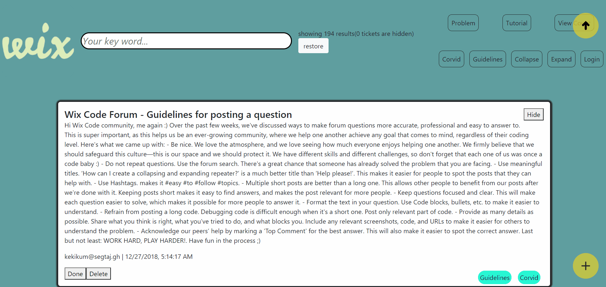
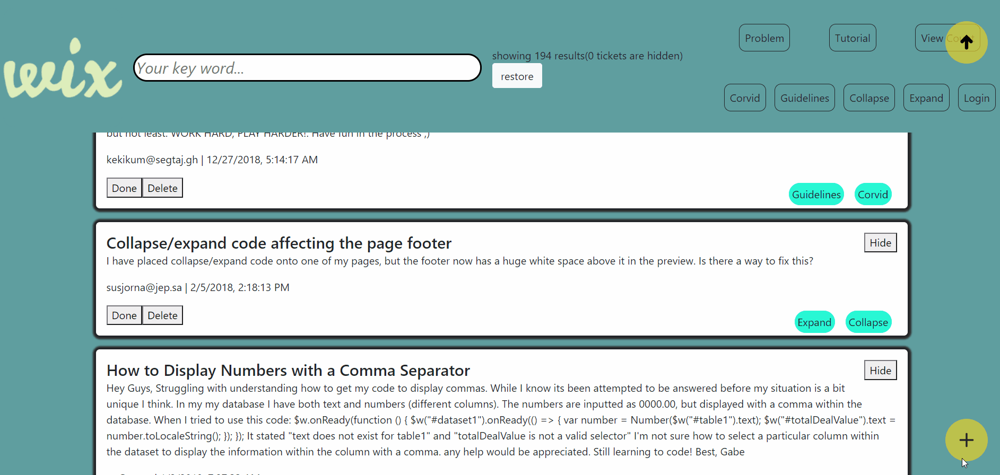
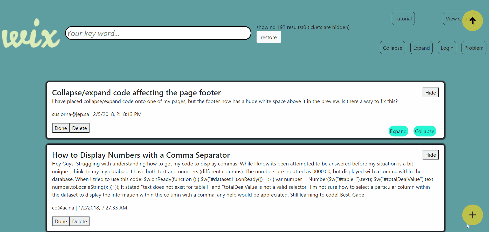

#  Final - Ticket Manager

this Ticket Manager Web Application created with the [MERN stack](https://www.educative.io/edpresso/what-is-mern-stack)
## and here is a link to my heroku app 

## 🎫🎫🎫🎫🎫🎫🎫🎫🎫🎫🎫🎫🎫🎫🎫🎫🎫🎫🎫🎫🎫🎫🎫
## here is some of the widgets- [ticket-manager-wix-way](https://ticket-manager-wix-way.herokuapp.com/)

## filter by the search bar 🔍🔍
# 

## hide and restore all data
# 

## ➕ add new ticket! ➕ - bonus -
# 

## filter by tags and mark as done or undone - 🔍🔍 tags filter bonus -
# 
